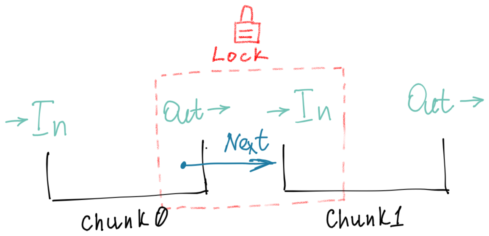

# Principle of operation

EventQueue is multi-producer, multi-consumer FIFO queue.
Performance-wise it is biased to the readers side. All reads are lockless and very fast.
Writes happens under lock, and does not block reads.

Single-threaded read performance is between `Vec` and `VecDeque` for best-case scenario; 1.5-2x slower then `VecDeque` - for worse.

Single-threaded write performance 4-5x slower then `VecDeque`. But writing with `EventQueue::extend` can give you `VecDeque`-like performance.

Memory-wise there is only fixed overhead. Each reader is just kind a pointer. 


## The main idea


EventQueue's storage is a single-linked list of chunks.
In order to read from it, you need to register a Reader (Reader is kinda consuming forward iterator).
As soon as all readers process the chunk - it is safe to free it.
Thus - we only need to track the number of readers that completely read the chunk.

Chunk's `read_count` atomic +1 operation happens only when `Reader` cross inter-chunk boundary. And that's basically 
all atomic stores for reader.

One important thing to remember: is that both - writers and readers - go in one direction, they can not "jump".
This means that if reader are in chunk 2 - chunks 0 and 1 are read.

## EventQueue

```rust
struct EventQueue{
    list: Mutex<List<Chunk>>,   // this is writer lock
    readers_count: usize,
}
```

```rust
struct Chunk<T, const CAPACITY: usize>{
    storage: [T; CAPACITY],
    len: AtomicUsize,
    read_count: AtomicUsize,
    next: AtomicPtr,
    event: &Event,
}
```
Synchronization between EventQueue and Readers happens on `Chunk::len` atomic Release/Acquire.
When writer `push`, it locks `list`, write to chunk, then atomically increase `Chunk::len` (Release).

Reader on start of the read, atomically load `Chunk::len` (Acquire). This guarantees that all memory writes, that happened
prior to `len` Release will become visible on current thread (in analogue with spin lock).

## Reader

```rust
struct Reader{
    chunk: *const Chunk,
    index: usize
}
```
In order to read, `Reader` need:
1) Atomic load `chunk` len.
2) Read and increment `index` until the end of chunk reached.
3) If chunk len == chunk capacity, do atomic load `Chunk::next` and switch chunk. Else - stop. 
4) If we jumped to the next chunk - `fetch_add` `Chunk::read_count`. If `Chunk::read_count` == `EventQueue::readers_count` do `cleanup`.

As you can see, most of the time, it works like `slice`. And touch only chunk's memory.

`EventQueue::clenup` traverse event chunks, and dispose those, with read_count == readers_count. So, as soon as we increase
`Chunk::read_count`, there is a chance that chunk will be disposed. This means, that we have either return item copies, 
or postpone increasing `Chunk::read_count` until we finish read session. Currently, `event_chunk_rs` do second.

`Reader::irer()` serves in role of read session. On construction, it reads `Chunk::len`, on destruction updates `Chunk::read_count`.  

## Clear

EventQueue does not track readers, and readers does not signal/lock on read start/end.

Clearing - means pointing readers to the end of the queue. To achieve that, `Event`- 
on `clear()` -  stores current queue end position (*chunk + index) in `Event::start_position`.  
`Reader`, on read session start, reads `start_position` from `Event`, and move it's position forward, if needed.

We add following fields to `EventQueue`: 
```rust
struct EventQueue{
    ...
    start_position_chunk: *const Chunk,
    start_position_index: usize,
}
```
This technique has one side effect - **it does not actually free memory immediately**. Readers need to advance first.
So if you want to truncate queue, due to memory limits, you need to touch all associated readers, after `clear()`.


### `start_position` optimisation

We add notion of `start_position_epoch`. Each time `start_position` updated - `start_position_epoch` increased.
`start_position_epoch` fuses with `Chunk::len` - this way we have only one atomic load for reader. _So technically, instead
of storing `start_position_epoch` in EventQueue, we store it duplicates in all chunks. So, on each `clear` we have to update
all chunks values. But it's ok - since chunks number are low, and clear is relatively rare._

So in the end:

```rust
struct Chunk{
    ...
    len_and_epoch: AtomicUsize
}
```
Also, Reader need its own start_position_epoch:
```rust
struct Reader{
    ...
    start_position_epoch: u32
}
```

Reader, with one atomic load, read both chunk len, and current start_point_epoch. 
If start_point_epoch does not match current, we update Reader's position and mark chunks in-between as read.

## Dynamic chunk size

Chunk sizes have `[N, N, N*2, N*2, N*4, N*4, ...]` pattern (`[4,4,8,8,16,16,..]`).
If we would simply increase size on each next chunk - we would simply grow infinitely.
If we have only one chunk left, and previous chunk had the same size - we found ideal size for our queue.

## Сhunk recycling

With `feature="double_buffering"` enabled, the biggest freed chunk will be stored for further reuse.

## Tracking readers. Out-of-order chunks disposable.



In order to be able to immediately dispose chunks on cleanup/truncate, we need to know which chunks
are free from readers. To do that, we add "In" counter. Whenever "In" = "Out" - chunk is free of
readers.

On the EventQueue side:
- Write lock prev.chunk_switch_mutex
- If In == Out - it is safe to dispose chunk: 
  - Change Next pointer to next chunk
  - free chunk
- Release mutex

_We lock only left-side chunk mutex (with In), because Reader cannot get Out+=1, without In+=1.
In other words, it cannot get into chunk by omitting left-side lock and In+=1. And reader moves
left to right only._

On the EventReader side, during chunk switch:
- Read lock prev.chunk_switch_mutex
- Read next chunk
- Out+=1, Next.In+=1
- Release mutex

## Optimisation techniques

_TODO: AUTO_CLEANUP=false_

_TODO: copy iter vs deferred read mark_
